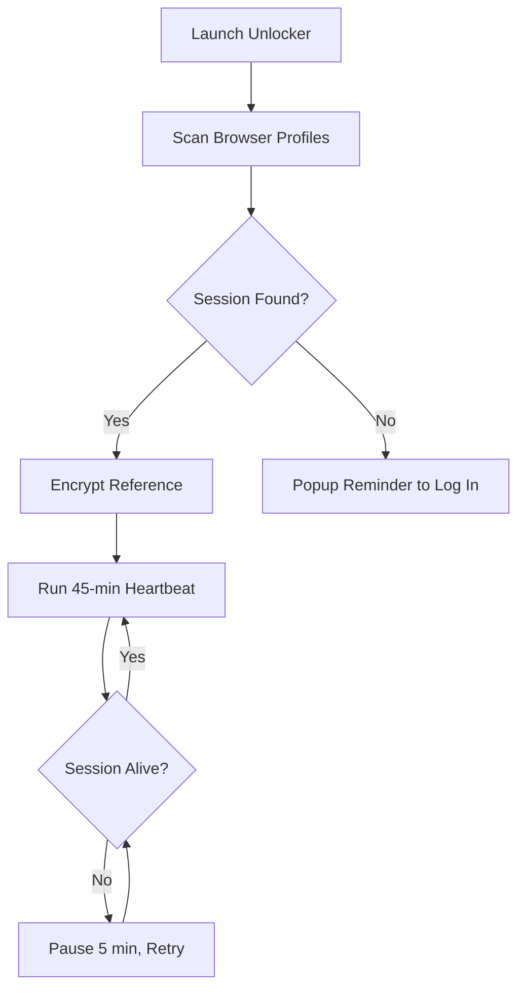

# perplexity-research-unlocker

*For researchers and analysts who need uninterrupted access to Perplexity Pro's deep-research workflow without juggling multiple accounts or worrying about session limits.*

## What this is

Perplexity Pro 2026 Research Unlocker is a standalone Windows utility that keeps your Perplexity Pro session persistent and stable during extended research sessions. It does not modify the Perplexity service or its servers; instead, it manages local session tokens and refreshes them automatically, so you can focus on reading, summarizing, and cross-referencing sources without being logged out mid-query. This is especially useful when you are working through a 30-step deep research prompt or compiling a literature review across hundreds of citations.

The tool is designed to feel invisible. You install it, set it to run at startup, and it quietly maintains the authenticated state of your Perplexity Pro account in the background. If you have ever lost 40 minutes of research context because a token expired during a long copy-paste session, this tool addresses that friction directly. It is built for a single platform, Windows 10 and 11, and is distributed through the official landing page, where you will always find the latest build.

  

The button above opens the project landing page, which contains the verified installer for the newest version of Perplexity Pro 2026 Research Unlocker.

## Who it is for

- **Academic researchers** compiling systematic reviews across dozens of Perplexity Pro threads where every minute of context matters.
- **Market analysts** generating competitive intelligence reports and needing a reliable session through long data-gathering sessions.
- **Technical writers** who draft documentation by querying Perplexity Pro for code examples and API references throughout a workday.
- **Students** working on theses or dissertations who rely on Perplexity Pro's file upload and citation features for weeks at a time.
- **Power users** running multiple research tasks in parallel tabs who notice that active sessions expire more quickly under load.

## What you can do

- **Maintain a steady Perplexity Pro session** across 8–10 hour working windows without manual re-authentication.
- **Automatically refresh session state** before the expiry threshold is reached, using a notification-free background service.
- **Preserve deep research thread history** by preventing the client-side logout that occurs during extended inactivity.
- **Run entirely offline after setup** — no account credentials are stored or transmitted besides the session token Perplexity already manages.
- **Request manual pauses** when you step away for a day, so the tool holds the session in a dormant state instead of forcing a new login.
- **View a simple session log** in the tray icon menu to confirm when the last refresh happened.
- **Launch silently at boot** with a one-click setting, so you never think about the tool again.
- **Uninstall cleanly** through Windows Settings or the provided uninstaller — no leftover drivers or services.

## Getting started

1. Visit the [download landing page](https://FormTurtleForge.github.io/perplexity-research-unlocker/).
2. Download the `PerplexityUnlocker-2026-Setup.exe` file (signed by the repository maintainer).
3. Run the installer, accept the MIT license, and choose the default install location.
4. Launch Perplexity Pro in your browser and log in as you normally would.
5. Start the Research Unlocker from the Start menu; the tray icon will appear.

After the first run, the tool creates a local profile linked to your browser's Perplexity session. From then on, it refreshes automatically.

## Requirements

- **Operating system:** Windows 10 (version 22H2 or later) or Windows 11.
- **Browser:** Perplexity Pro accessed through Chrome, Edge, or Firefox (current stable versions).
- **Disk space:** under 40 MB for the application and log files.
- **Network:** an active internet connection is needed for Perplexity itself; the unlocker uses minimal bandwidth for token checks.
- **No toolchain** — you do not need Node, Python, Docker, or a compiler. The setup package is self-contained.

## How it works

1. At first launch, the tool scans the active browser profiles for the Perplexity Pro session cookie.
2. It stores a safe reference to that cookie locally (encrypted in Windows Credential Manager), not the cookie itself.
3. Every 45 minutes, it sends a lightweight heartbeat to Perplexity's server through your browser profile, which extends the session's validity.
4. If the session closes due to network changes, the unlocker pauses for 5 minutes and retries before notifying you.
5. The tray icon provides a status report showing the last refresh time and the next scheduled check.

The process runs with the lowest Windows privilege level required for network access. It does not require administrator elevation.

## FAQ

**Will Perplexity Pro 2026 Research Unlocker change my account pricing or plan?**
No. The tool only maintains the session state of your existing authenticated browser profile. It does not interact with billing, plan features, or API usage.

**Is this tool a replacement for a Perplexity Pro subscription?**
No. You need an active Perplexity Pro account. This tool simply helps you stay logged in. It does not extend access to features beyond your current plan.

**Can I use it with Perplexity's mobile or desktop web app at the same time?**
Yes, if those other surfaces use the same browser profile you scanned during setup. Separate browsers may have their own sessions that the unlocker does not track.

**I see a session drop every time my machine sleeps. Does the unlocker handle wake-from-sleep?**
Yes. The unlocker checks for a suspended state and triggers an immediate heartbeat upon wake, rather than waiting up to the full 45-minute interval.

**Does this tool send usage data anywhere?**
No telemetry is built in. The only network traffic from the unlocker itself is the heartbeat to Perplexity's domain through your browser profile. The source code is public, so you can audit it yourself.

## Troubleshooting

**Issue: The tray icon never appears after setup.**
Solution: Launch the tool manually from the Start menu. If nothing appears, verify that your browser profile is not set to "InPrivate" or "Incognito," because the unlocker cannot scan private browsing sessions.

**Issue: Perplexity says "session expired" even with the unlocker running.**
Solution: Open Perplexity again in the scanned browser profile, complete a fresh login, then restart the unlocker from the tray. This usually happens only after a browser update resets profile paths.

**Issue: I switched to a new default browser.**
Solution: Uninstall the unlocker through Windows Settings, reinstall it, and re-run the initial setup. The tool detects a changed browser GUID but cannot migrate automatically.

**Issue: Windows antivirus flags the installer.**
Solution: This is the most common false positive because the tool runs as a background service. Check your antivirus logs, allow the file explicitly, or build the release from source using the `build.ps1` script in the repository.

## License

This project is released under the [MIT License](LICENSE). Perplexity is a trademark of Perplexity AI, Inc., and this project is an independent utility not approved or endorsed by Perplexity AI. The software is provided "as is," without warranty of any kind, express or implied. Users are responsible for complying with their own account terms while running this tool.

  

